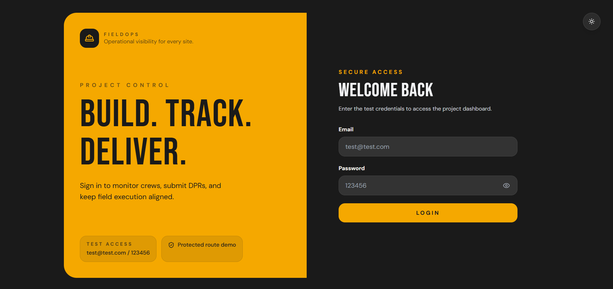
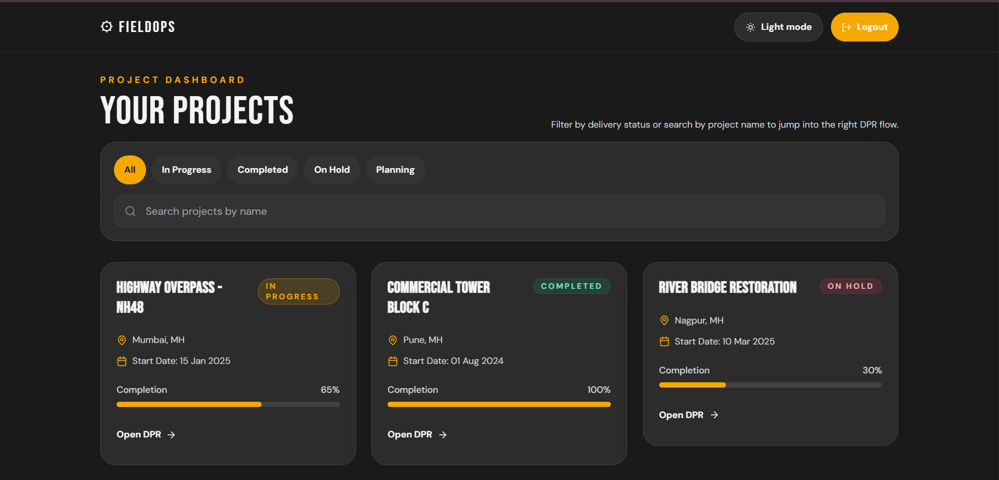
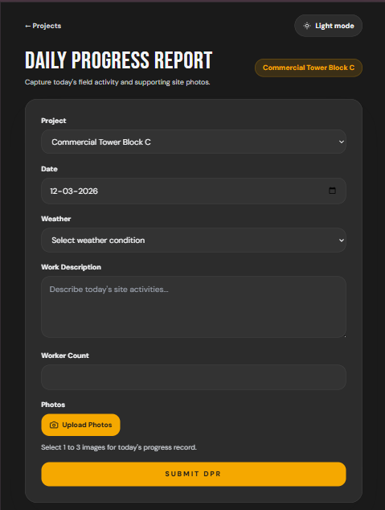

# ⚙️ FieldOps — Construction Field Management App

> A responsive React.js web application for construction site management — featuring mock authentication, project tracking with status filters, and Daily Progress Report (DPR) submission.

---

## 🌐 Live Demo

[](https://fieldops.vercel.app)

👉 **[View Live Demo](https://fieldops-alpha.vercel.app/)**

---

## 📸 Screenshots

### Login (Responsive Desktop View)


### Project List (Responsive Desktop View)


### DPR Form (iPad Mini View)



---

## 🛠️ Tech Stack

| Technology | Purpose |
|---|---|
| React 18 | UI framework |
| Vite | Build tool |
| Tailwind CSS | Styling with custom industrial palette |
| React Router v6 | Client-side routing & protected routes |
| Framer Motion | Page transitions & animations |
| react-hot-toast | Success & error notifications |
| lucide-react | Icon library |
| Axios | HTTP client (mock-ready) |

---

## 🚀 Getting Started

### Prerequisites
- Node.js v18+
- npm v9+

### Installation

```bash
# Clone the repository
git clone <your-repository-url>
cd Construction_Field_Manager

# Install dependencies
npm install

# Start the development server
npm run dev
```

The app will be running at `http://localhost:5173`

### Test Credentials

```
Email:    test@test.com
Password: 123456
```

---

## ✅ Features Implemented

- [x] Vite + React 18 app scaffold
- [x] Tailwind CSS with custom industrial color palette (`#F5A800` amber + `#1A1A1A` dark)
- [x] React Router v6 route structure
- [x] Protected routes backed by `AuthContext`
- [x] Dark mode toggle with `ThemeContext` and `localStorage` persistence
- [x] Full dark mode support across Login, Project List, and DPR Form
- [x] Animated page transitions using Framer Motion
- [x] Split-screen Login page with inline credential validation
- [x] Project List with real-time search and status filters
- [x] Responsive project cards with status badges and progress bars
- [x] DPR Form with full field validation and inline error messages
- [x] Photo upload with preview thumbnails, removal, and 3-image limit
- [x] Success and error feedback via react-hot-toast

---

## ⚠️ Known Limitations

- Authentication is mocked and only accepts the demo credentials shown on the login page.
- Project and DPR data are hardcoded — no backend API is connected.
- Photos uploaded in the DPR form are previewed locally and are not persisted after a page refresh.

---

## 📁 Project Structure

```
src/
├── pages/
│   ├── Login.jsx
│   ├── ProjectList.jsx
│   └── DPRForm.jsx
├── components/
│   ├── Navbar.jsx
│   ├── ProjectCard.jsx
│   ├── StatusBadge.jsx
│   ├── ThemeToggle.jsx
│   ├── PhotoUpload.jsx
│   └── InputField.jsx
├── context/
│   ├── AuthContext.jsx
│   └── ThemeContext.jsx
├── constants/
│   ├── projects.js
│   └── mockData.js
├── utils/
│   └── validators.js
├── App.jsx
└── main.jsx
```

---

## 👩‍💻 Author

**Shreya Awari**

📧 Email: [shreyaawari31@gmail.com](mailto:shreyaawari31@gmail.com)
🌐 GitHub: [github.com/shreyaawari28](https://github.com/shreyaawari28)

---

⭐ Feel free to **star the repository** if you find it useful!
